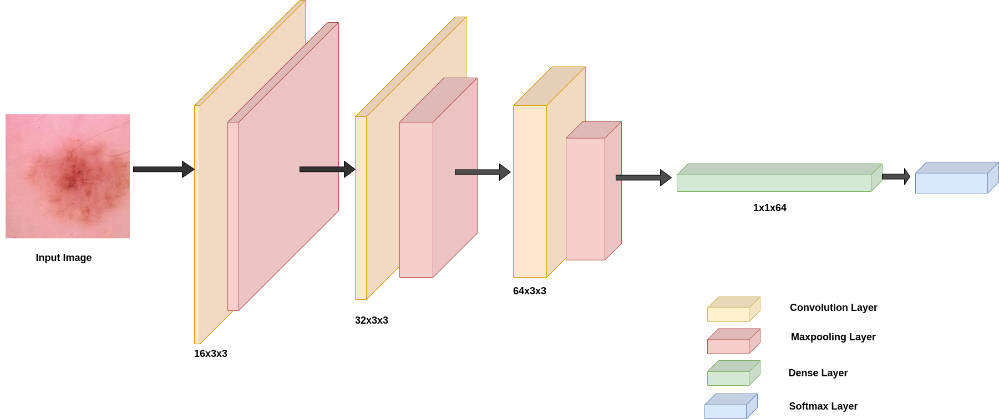
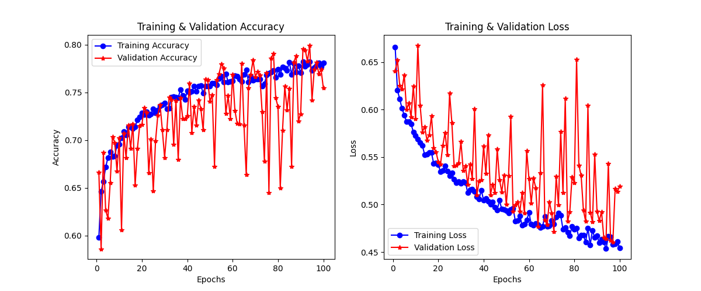

# Skin Cancer Classification

## Overview
This project focuses on classifying skin cancer images into benign or malignant categories using deep learning. The model is built using TensorFlow/Keras and follows a structured approach for training, evaluation, and inference, allowing the use of different model architectures: CNN, ConvNeXt, and Vision Transformer (ViT).

 📝**Detailed Project Report :** [Click Here](project_report/Skin_Cancer_Image_Classification-Rajat%20Mehta.pdf)  

## Directory Structure

```
Skin-Cancer-Classification/
│── models/                   # Trained models saved here
│── notebooks/                # Jupyter notebooks for experiments
│── src/                      # Source code for the project
│   │── __init__.py           # Marks src as a Python package
│   │── main.py               # Main entry point for evaluation
│   │── train.py              # Script to train the model
│   │── inference.py          # Script for model inference
│   │── data.py               # Handles data loading and preprocessing
│   │── model.py              # Defines the model architecture (CNN, ConvNeXt, ViT)
│   │── helper.py             # Utility functions (visualization, logging, etc.)
│── datasets/                 # Store datasets here (not included in repo)
│── requirements.txt          # List of dependencies
│── .gitignore                # Files and directories to ignore in Git
│── README.md                 # Project documentation
```

## Installation

### Prerequisites
Ensure you have Python installed. It's recommended to use a virtual environment.

### Steps
```
# Clone the repository
git clone https://github.com/yourusername/Skin-Cancer-Classification.git
cd Skin-Cancer-Classification

# Create a virtual environment and activate it
python -m venv venv  # For Windows
source venv/bin/activate  # For macOS/Linux

# Install dependencies
pip install -r requirements.txt
```

## Dataset
This project uses a dataset of skin cancer images with a train-test split. Ensure the dataset is placed inside the `datasets/` directory.

### Dataset Samples
Below are some sample images from the dataset:

  
*Figure 1: Example images from the dataset (benign vs. malignant).*

## Model Architectures
This project supports three different model architectures:

### Convolutional Neural Network (CNN)
  
*Figure 2: CNN model architecture.*

### ConvNeXt
  
*Figure 3: ConvNeXt model architecture.*


## Training the Model
To train the model, run:

```
python src/train.py --model <model_type>
```

Where `<model_type>` can be one of the following:

- cnn: for training with the CNN architecture
- convnext: for training with the ConvNeXt architecture
- vit: for training with the Vision Transformer (ViT) architecture

For example, to train the model with ConvNeXt:

```
python src/train.py --model convnext
```

The trained model will be saved in the `models/` directory with the respective model name (`cnn_skin_cancer_model.h5`, `convnext_skin_cancer_model.h5`, or `vit_skin_cancer_model.h5`).

## Training Results & Graphs
Below are the loss and accuracy curves obtained during training:

### Training and Validation Loss and Accuracy Curves
  
*Figure 5: Training and validation loss and Accuracy curves.*

## Evaluating the Model
After training, evaluate the model using:

```
python src/main.py --model <model_type>
```

Where `<model_type>` should match the model used during training (e.g., `cnn`, `convnext`, `vit`). For example, to evaluate the ConvNeXt model:

```
python src/main.py --model convnext
```

## Running Inference
To test the model on new images, use:

```
python src/inference.py --model <model_type> --image_path path/to/image.jpg
```

Where `<model_type>` should be one of the model types used during training (`cnn`, `convnext`, or `vit`), and `--image_path` specifies the image path for inference. For example, to run inference with the CNN model:

```
python src/inference.py --model cnn --image_path path/to/image.jpg
```

## Future Improvements
- Hyperparameter tuning
- Data augmentation
- Deployment as a web API

## Contributing
Feel free to fork the repository and submit pull requests.

## License
This project is licensed under the MIT License.

